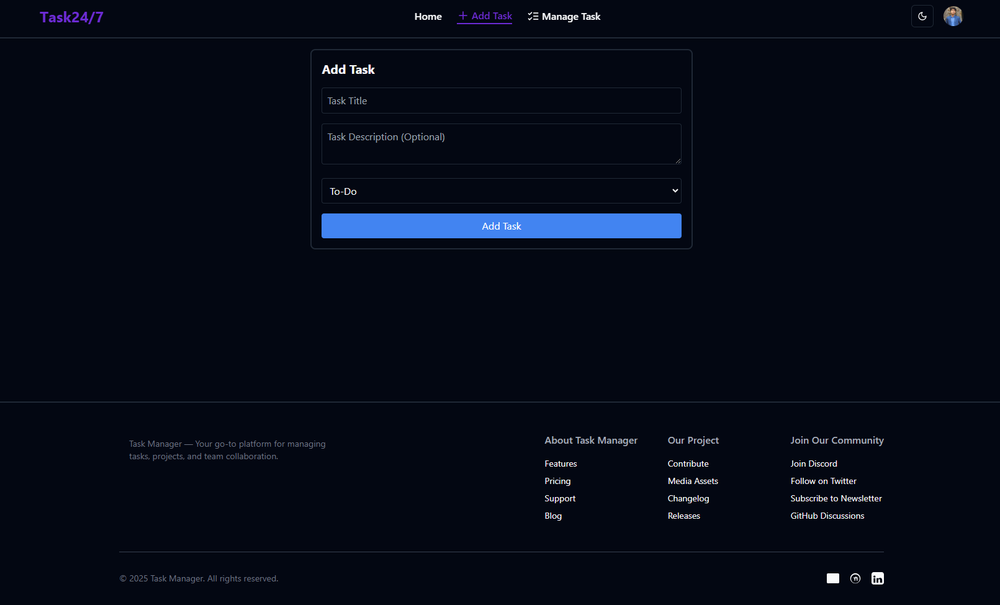

# Task24/7 - Task Management Application

Welcome to **Task24/7**, a powerful and intuitive task management web application designed to help individuals and teams organize, manage, and track their tasks effortlessly. Whether you're managing personal tasks or collaborating with a team, Task24/7 is built to make your productivity soar!

---

## 🌟 Features

- **Create Tasks**: Add new tasks with titles, descriptions, and categories (To-Do, In Progress, Done).
- **Drag-and-Drop Task Management**: Easily move tasks between categories to stay organized.
- **Real-time Updates**: Seamlessly sync and update your tasks across devices with backend integration.
- **User Authentication**: Sign in and personalize your task list.
- **Responsive Design**: Works perfectly on desktops, tablets, and mobile devices.
- **Task Prioritization**: Organize tasks by priority and deadlines.

---

## 🚀 Live Demo

Try out the app in action! Visit the live version here:

**[Live Demo](https://task-management-server-ky30xs329-md-redwanul-haques-projects.vercel.app)**

---

## ⚙️ Technologies Used

- **Frontend**:
  - React.js
  - React Hook Form (for form handling)
  - Axios (for API requests)
  - TailwindCSS (for styling)
  - React Helmet (for dynamic title management)
  - React Hot Toast (for toast notifications)

- **Backend**:
  - Node.js
  - Express.js
  - MongoDB (for data storage)
  - Mongoose (MongoDB object modeling)

---

## 🎨 Screenshots

Here’s a preview of how the Task24/7 application looks:



---

### 👤 About Me
- **Name:** MThe001
I'm a passionate web developer with a love for creating dynamic, user-friendly applications. I enjoy exploring new technologies and building projects that make a difference.

## ✉️ Contact Information:
- **Email:** [mtheredwanulhaque@gmail.com]
- **GitHub:** https://github.com/Mthe001

## 🧩 Hobbies:
- **Coding:** I'm always learning and building new things.
- **Photography:** I enjoy capturing beautiful moments through the lens.
- **Gaming:** A casual gamer, always up for a good challenge.
- **Music:** Listening to all kinds of music, especially indie rock and electronic.


## 🛠 Installation

Follow the steps below to set up this project on your local machine.

### Prerequisites

Make sure you have the following installed:
- **Node.js** and **npm** (Node Package Manager)
- **MongoDB** (or use a cloud-based MongoDB service like MongoDB Atlas)


## 🚧 Installation

### Step 1: Clone the Repository
```bash
git clone https://github.com/Mthe001/task-management.git
cd news240


